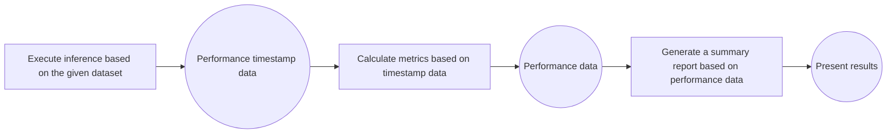

# Guide to Service-Oriented Performance Evaluation
## Introduction
AISBench Benchmark provides service-oriented performance evaluation capabilities. For streaming inference scenarios, it systematically evaluates key performance indicators of model services in real-world deployment environments—such as response latency (e.g., TTFT, Inter-Token Latency), throughput capacity (e.g., QPS, TPUT), and concurrent processing capability—by accurately recording the send time of each request, the return time of each stage, and the response content.

Users can flexibly control request content, request intervals, concurrent quantities, and other parameters by configuring service-oriented backend parameters to adapt to different evaluation scenarios (e.g., low-concurrency latency-sensitive scenarios, high-concurrency throughput-priority scenarios). The evaluation supports automated execution and outputs structured results, facilitating horizontal comparison of service performance differences across different models, deployment solutions, and hardware configurations.


## Quick Start for Service-Oriented Performance Evaluation
### Command Meaning
The meaning of the AISBench service-oriented performance evaluation command is the same as explained in 📚 [Tool Quick Start/Command Meaning](../../get_started/quick_start.md#command-meaning). On this basis, you need to add `--mode perf` or `-m perf` to enter the performance evaluation scenario. Take the following AISBench command as an example:
```shell
ais_bench --models vllm_api_stream_chat --datasets demo_gsm8k_gen_4_shot_cot_chat_prompt --summarizer default_perf --mode perf
```
Among them:
- `--models` specifies the model task, i.e., the `vllm_api_stream_chat` model task.
- `--datasets` specifies the dataset task, i.e., the `demo_gsm8k_gen_4_shot_cot_chat_prompt` dataset task.
- `--summarizer` specifies the result presentation task, i.e., the `default_perf` result presentation task (if `--summarizer` is not specified, the `default_perf` task is used by default in accuracy evaluation scenarios). It is generally used by default and does not need to be specified in the command line; subsequent commands will omit this parameter.

### Task Meaning Query (Optional)
Specific information (introduction, usage constraints, etc.) about the selected model task `vllm_api_stream_chat`, dataset task `demo_gsm8k_gen_4_shot_cot_chat_prompt`, and result presentation task `default_perf` can be queried from the following links:
- `--models`: 📚 [Service-Oriented Inference Backend](../all_params/models.md#service-oriented-inference-backend)
- `--datasets`: 📚 [Open-Source Datasets](../all_params/datasets.md#open-source-datasets) → 📚 [Detailed Introduction](https://github.com/AISBench/benchmark/tree/master/ais_bench/benchmark/configs/datasets/demo/README_en.md)
- `--summarizer`: 📚 [Result Summary Tasks](../all_params/summarizer.md#supported-result-summary-tasks)

### Preparations Before Running the Command
- `--models`: To use the `vllm_api_stream_chat` model task, you need to prepare an inference service that supports the `v1/chat/completions` sub-service. You can refer to 🔗 [VLLM Launch OpenAI-Compatible Server](https://docs.vllm.com.cn/en/latest/getting_started/quickstart.html#openai-compatible-server) to start the inference service.
- `--datasets`: To use the `demo_gsm8k_gen_4_shot_cot_chat_prompt` dataset task, you need to prepare the GSM8K dataset, which can be downloaded from 🔗 [GSM8K Dataset Compressed Package Provided by OpenCompass](http://opencompass.oss-cn-shanghai.aliyuncs.com/datasets/data/gsm8k.zip). Deploy the unzipped `gsm8k/` folder to the `ais_bench/datasets` folder in the root path of the AISBench evaluation tool.

### Modify Configuration Files Corresponding to Tasks
Each model task, dataset task, and result presentation task corresponds to a configuration file. These files need to be modified before running the command. The paths of these configuration files can be queried by adding `--search` to the original AISBench command. For example:
```shell
# Note: Whether to add "--mode perf" to the search command does not affect the search result
ais_bench --models vllm_api_stream_chat --datasets demo_gsm8k_gen_4_shot_cot_chat_prompt --mode perf --search
```
> ⚠️ **Note**: Executing the command with `--search` will print the absolute paths of the configuration files corresponding to the tasks.

Executing the query command will yield the following results:
```shell
06/28 11:52:25 - AISBench - INFO - Searching configs...
╒══════════════╤═══════════════════════════════════════╤════════════════════════════════════════════════════════════════════════════════════════════════════════════════════════════════╕
│ Task Type    │ Task Name                             │ Config File Path                                                                                                               │
╞══════════════╪═══════════════════════════════════════╪════════════════════════════════════════════════════════════════════════════════════════════════════════════════════════════════╡
│ --models     │ vllm_api_stream_chat                  │ /your_workspace/benchmark/ais_bench/benchmark/configs/models/vllm_api/vllm_api_stream_chat.py                                 │
├──────────────┼───────────────────────────────────────┼────────────────────────────────────────────────────────────────────────────────────────────────────────────────────────────────┤
│ --datasets   │ demo_gsm8k_gen_4_shot_cot_chat_prompt │ /your_workspace/benchmark/ais_bench/benchmark/configs/datasets/demo/demo_gsm8k_gen_4_shot_cot_chat_prompt.py                   │
╘══════════════╧═══════════════════════════════════════╧════════════════════════════════════════════════════════════════════════════════════════════════════════════════════════════════╛
```

- The configuration file `demo_gsm8k_gen_4_shot_cot_chat_prompt.py` for the dataset task in the quick start does not require additional modifications. For an introduction to the content of the dataset task configuration file, refer to 📚 [Configure Open-Source Datasets](../all_params/datasets.md#configure-open-source-datasets).

The model configuration file `vllm_api_stream_chat.py` contains configuration content related to model operation and needs to be modified according to the actual situation. The content that needs to be modified in the quick start is marked with comments:
```python
from ais_bench.benchmark.models import VLLMCustomAPIChatStream

models = [
    dict(
        attr="service",
        type=VLLMCustomAPIChatStream,
        abbr='vllm-api-stream-chat',
        path="",                    # Specify the absolute path to the model's serialized vocabulary file; generally, this is the path to the model weight folder
        model="DeepSeek-R1",        # Specify the name of the model loaded on the server; configure it according to the actual model name pulled by the VLLM inference service (set to an empty string to obtain it automatically)
        request_rate = 0,           # Request sending frequency: send 1 request to the server every 1/request_rate seconds; if less than 0.1, all requests are sent at once
        retry = 2,                  # Maximum number of retries per request
        host_ip = "localhost",      # Specify the IP address of the inference service
        host_port = 8080,           # Specify the port of the inference service
        max_out_len = 512,          # Maximum number of tokens output by the inference service
        batch_size=1,               # Maximum concurrency for sending requests
        generation_kwargs = dict(   # Model inference parameters shall be configured with reference to the VLLM documentation. The AISBench evaluation tool does not process these parameters, which will be included in the sent request.
            temperature = 0.5,
            top_k = 10,
            top_p = 0.95,
            seed = None,
            repetition_penalty = 1.03,
            ignore_eos = True,      # The inference service output ignores EOS (the output length will definitely reach max_out_len)
        )
    )
]
```

### Execute the Command
After modifying the configuration file, execute the command to start the service-oriented performance evaluation (⚠️ It is recommended to add `--debug` for the first execution to print detailed logs to the screen, which makes it easier to handle errors during the request inference service process):
```bash
# Add --debug to the command line
ais_bench --models vllm_api_stream_chat --datasets demo_gsm8k_gen_4_shot_cot_chat_prompt -m perf --debug
```

### View Performance Results
An example of the on-screen performance results is as follows:

```bash
06/05 20:22:24 - AISBench - INFO - Performance Results of task: vllm-api-stream-chat/gsm8kdataset:

╒══════════════════════════╤═════════╤══════════════════╤══════════════════╤══════════════════╤══════════════════╤══════════════════╤══════════════════╤══════════════════╤══════╕
│ Performance Parameters   │ Stage   │ Average          │ Min              │ Max              │ Median           │ P75              │ P90              │ P99              │  N   │
╞══════════════════════════╪═════════╪══════════════════╪══════════════════╪══════════════════╪══════════════════╪══════════════════╪══════════════════╪══════════════════╪══════╡
│ E2EL                     │ total   │ 2048.2945  ms    │ 1729.7498 ms     │ 3450.96 ms       │ 2491.8789 ms     │ 2750.85 ms       │ 3184.9186 ms     │ 3424.4354 ms     │ 8    │
├──────────────────────────┼─────────┼──────────────────┼──────────────────┼──────────────────┼──────────────────┼──────────────────┼──────────────────┼──────────────────┼──────┤
│ TTFT                     │ total   │ 50.332 ms        │ 50.6244 ms       │ 52.0585 ms       │ 50.3237 ms       │ 50.5872 ms       │ 50.7566 ms       │ 50.0551 ms       │ 8    │
├──────────────────────────┼─────────┼──────────────────┼──────────────────┼──────────────────┼──────────────────┼──────────────────┼──────────────────┼──────────────────┼──────┤
│ TPOT                     │ total   │ 10.6965 ms       │ 10.061 ms        │ 10.8805 ms       │ 10.7495 ms       │ 10.7818 ms       │ 10.808 ms        │ 10.8582 ms       │ 8    │
├──────────────────────────┼─────────┼──────────────────┼──────────────────┼──────────────────┼──────────────────┼──────────────────┼──────────────────┼──────────────────┼──────┤
│ ITL                      │ total   │ 10.6965 ms       │ 7.3583 ms        │ 13.7707 ms       │ 10.7513 ms       │ 10.8009 ms       │ 10.8358 ms       │ 10.9322 ms       │ 8    │
├──────────────────────────┼─────────┼──────────────────┼──────────────────┼──────────────────┼──────────────────┼──────────────────┼──────────────────┼──────────────────┼──────┤
│ InputTokens              │ total   │ 1512.5           │ 1481.0           │ 1566.0           │ 1511.5           │ 1520.25          │ 1536.6           │ 1563.06          │ 8    │
├──────────────────────────┼─────────┼──────────────────┼──────────────────┼──────────────────┼──────────────────┼──────────────────┼──────────────────┼──────────────────┼──────┤
│ OutputTokens             │ total   │ 287.375          │ 200.0            │ 407.0            │ 280.0            │ 322.75           │ 374.8            │ 403.78           │ 8    │
├──────────────────────────┼─────────┼──────────────────┼──────────────────┼──────────────────┼──────────────────┼──────────────────┼──────────────────┼──────────────────┼──────┤
│ OutputTokenThroughput    │ total   │ 115.9216 token/s │ 107.6555 token/s │ 116.5352 token/s │ 117.6448 token/s │ 118.2426 token/s │ 118.3765 token/s │ 118.6388 token/s │ 8    │
╘══════════════════════════╧═════════╧══════════════════╧══════════════════╧══════════════════╧══════════════════╧══════════════════╧══════════════════╧══════════════════╧══════╛
╒══════════════════════════╤═════════╤════════════════════╕
│ Common Metric            │ Stage   │ Value              │
╞══════════════════════════╪═════════╪════════════════════╡
│ Benchmark Duration       │ total   │ 19897.8505 ms      │
├──────────────────────────┼─────────┼────────────────────┤
│ Total Requests           │ total   │ 8                  │
├──────────────────────────┼─────────┼────────────────────┤
│ Failed Requests          │ total   │ 0                  │
├──────────────────────────┼─────────┼────────────────────┤
│ Success Requests         │ total   │ 8                  │
├──────────────────────────┼─────────┼────────────────────┤
│ Concurrency              │ total   │ 0.9972             │
├──────────────────────────┼─────────┼────────────────────┤
│ Max Concurrency          │ total   │ 1                  │
├──────────────────────────┼─────────┼────────────────────┤
│ Request Throughput       │ total   │ 0.4021 req/s       │
├──────────────────────────┼─────────┼────────────────────┤
│ Total Input Tokens       │ total   │ 12100              │
├──────────────────────────┼─────────┼────────────────────┤
│ Prefill Token Throughput │ total   │ 17014.3123 token/s │
├──────────────────────────┼─────────┼────────────────────┤
│ Total generated tokens   │ total   │ 2299               │
├──────────────────────────┼─────────┼────────────────────┤
│ Input Token Throughput   │ total   │ 608.7438 token/s   │
├──────────────────────────┼─────────┼────────────────────┤
│ Output Token Throughput  │ total   │ 115.7835 token/s   │
├──────────────────────────┼─────────┼────────────────────┤
│ Total Token Throughput   │ total   │ 723.5273 token/s   │
╘══════════════════════════╧═════════╧════════════════════╛

06/05 20:22:24 - AISBench - INFO - Performance Result files locate in outputs/default/20250605_202220/performances/vllm-api-stream-chat.
```
💡 For the meaning of specific performance parameters, refer to 📚 [Explanation of Performance Evaluation Results](../results_intro/performance_metric.md)

### Viewing Performance Details
After executing the AISBench command, more details of task execution are finally saved to the default output path. This output path is indicated in the printed logs during runtime, for example:
```shell
06/28 15:13:26 - AISBench - INFO - Current exp folder: outputs/default/20250628_151326
```
This log indicates that the task execution details are saved in `outputs/default/20250628_151326` under the path where the command is executed.

After the command execution is completed, the task execution details in `outputs/default/20250628_151326` are as follows:
```shell
20250628_151326           # Unique directory generated based on timestamp for each experiment
├── configs               # All automatically stored dumped configuration files
├── logs                  # Logs during execution; if --debug is added to the command, no process logs will be saved to disk (all are printed directly)
│   └── performance/      # Log files of the inference stage
└── performance           # Performance evaluation results
│    └── vllm-api-stream-chat/          # Name of the "service-oriented model configuration", corresponding to the abbr parameter in models of the model task configuration file
│         ├── gsm8kdataset.csv          # Single request performance output (CSV), consistent with the Performance Parameters table in the printed performance results
│         ├── gsm8kdataset.json         # End-to-end performance output (JSON), consistent with the Common Metric table in the printed performance results
│         ├── gsm8kdataset_details.json # Full打点日志 (JSON) [Note: "打点日志" refers to detailed timestamped logging of key events]
│         └── gsm8kdataset_plot.html    # Request concurrency visualization report (HTML)
```
💡 It is recommended to open the `gsm8kdataset_plot.html` (request concurrency visualization report) with browsers such as Chrome or Edge. You can view the latency of each request and the number of concurrent service tasks perceived by the client at each moment:
  
For instructions on using this HTML visualization file, please refer to 📚 [Instructions for Using Performance Test Concurrency Visualization Charts](../results_intro/performance_visualization.md)

## Preconditions for Service-Oriented Performance Evaluation
Before performing service-oriented inference, the following conditions must be met:

- Accessible service-oriented model service: Ensure the service process is directly accessible in the current environment.
- Dataset preparation:
    - Open-source datasets: Select a dataset from 📚 [Open-Source Datasets](../all_params/datasets.md#open-source-datasets), and choose the dataset task to execute in the "Detailed Introduction" document corresponding to the dataset. Prepare the dataset files by referring to the "Detailed Introduction" document of the selected dataset task. It is recommended to manually place the open-source dataset in the default directory `ais_bench/datasets/`, and the program will automatically load the dataset files during task execution.
    - Randomly synthesized datasets: Select `synthetic_gen` as the dataset task. For other configurations, refer to 📚 [Randomly Synthesized Datasets](../../advanced_tutorials/synthetic_dataset.md).
    - Custom datasets: No need to specify a dataset task. For other configurations, refer to 📚 [Custom Datasets](../../advanced_tutorials/custom_dataset.md).
- Service-oriented model backend configuration: Select a sub-service with the interface type `streaming interface` from [Service-Oriented Inference Backends](../all_params/models.md#service-oriented-inference-backends) (⚠️ Other types are not supported).

## Main Functional Scenarios
### Single-Task Evaluation
Refer to [Quick Start for Service-Oriented Performance Evaluation](#Quick Start for Service-Oriented Performance Evaluation)
### Multi-Task Evaluation
Supports simultaneous configuration of multiple models or multiple dataset tasks, enabling batch evaluation through a single command, which is suitable for serial execution of multiple test commands.
#### Command Description
Users can specify multiple configuration tasks through the `--models` and `--datasets` parameters. The number of subtasks is the product of the number of tasks configured in `--models` and `--datasets`, that is, one model configuration and one dataset configuration form a subtask. Example:
```bash
ais_bench --models vllm_api_general_stream vllm_api_stream_chat --datasets gsm8k_gen_4_shot_cot_str aime2024_gen_0_shot_str --mode perf
```
The above command specifies 2 model tasks (`vllm_api_general_stream` and `vllm_api_stream_chat`) and 2 dataset tasks (`gsm8k_gen_4_shot_cot_str` and `aime2024_gen_0_shot_str`), and will execute the following 4 combined performance test tasks:
+ [vllm_api_general_stream](https://github.com/AISBench/benchmark/tree/master/ais_bench/benchmark/configs/models/vllm_api/vllm_api_general_stream.py) model task + [gsm8k_gen_4_shot_cot_str](https://github.com/AISBench/benchmark/tree/master/ais_bench/benchmark/configs/datasets/gsm8k/gsm8k_gen_4_shot_cot_str.py) dataset task
+ [vllm_api_general_stream](https://github.com/AISBench/benchmark/tree/master/ais_bench/benchmark/configs/models/vllm_api/vllm_api_general_stream.py) model task + [aime2024_gen_0_shot_str](https://github.com/AISBench/benchmark/tree/master/ais_bench/benchmark/configs/datasets/aime2024/aime2024_gen_0_shot_str) dataset task
+ [vllm_api_stream_chat](https://github.com/AISBench/benchmark/tree/master/ais_bench/benchmark/configs/models/vllm_api/vllm_api_stream_chat.py) model task + [gsm8k_gen_4_shot_cot_str](https://github.com/AISBench/benchmark/tree/master/ais_bench/benchmark/configs/datasets/gsm8k/gsm8k_gen_4_shot_cot_str.py) dataset task
+ [vllm_api_stream_chat](https://github.com/AISBench/benchmark/tree/master/ais_bench/benchmark/configs/models/vllm_api/vllm_api_stream_chat.py) model task + [aime2024_gen_0_shot_str](https://github.com/AISBench/benchmark/tree/master/ais_bench/benchmark/configs/datasets/aime2024/aime2024_gen_0_shot_str.py) dataset task

#### Modifying Configuration Files Corresponding to Tasks
The actual paths of the configuration files corresponding to model tasks and dataset tasks can be queried by executing the command with `--search`:
```bash
ais_bench --models vllm_api_general_stream vllm_api_stream_chat --datasets gsm8k_gen_4_shot_cot_str aime2024_gen_0_shot_str --mode perf --search
```
The following configuration files to be modified are found:
```bash
╒═════════════╤══════════════════════════╤═══════════════════════════════════════════════════════════════════════════════════════════════════════════════════════════╕
│ Task Type   │ Task Name                │ Config File Path                                                                                                          │
╞═════════════╪══════════════════════════╪═══════════════════════════════════════════════════════════════════════════════════════════════════════════════════════════╡
│ --models    │ vllm_api_general_stream  │ /your_workspace/benchmark_test/ais_bench/benchmark/configs/models/vllm_api/vllm_api_general_stream.py                     │
├─────────────┼──────────────────────────┼───────────────────────────────────────────────────────────────────────────────────────────────────────────────────────────┤
│ --models    │ vllm_api_stream_chat     │ /your_workspace/benchmark_test/ais_bench/benchmark/configs/models/vllm_api/vllm_api_stream_chat.py                        │
├─────────────┼──────────────────────────┼───────────────────────────────────────────────────────────────────────────────────────────────────────────────────────────┤
│ --datasets  │ gsm8k_gen_4_shot_cot_str │ /your_workspace/benchmark_test/ais_bench/benchmark/configs/datasets/gsm8k/gsm8k_gen_4_shot_cot_str.py                     │
├─────────────┼──────────────────────────┼───────────────────────────────────────────────────────────────────────────────────────────────────────────────────────────┤
│ --datasets  │ aime2024_gen_0_shot_str  │ /your_workspace/benchmark_test/ais_bench/benchmark/configs/datasets/aime2024/aime2024_gen_0_shot_str.py                   │
╘═════════════╧══════════════════════════╧═══════════════════════════════════════════════════════════════════════════════════════════════════════════════════════════╛

```
- Refer to 📚 [Description of Configuration Parameters for Service-Oriented Inference Backends](../all_params/models.md#description-of-configuration-parameters-for-service-oriented-inference-backends) to configure the configuration files corresponding to the model tasks `vllm_api_general_stream` and `vllm_api_stream_chat` according to the actual situation.
- Refer to 📚 [Configuring Open-Source Datasets](../all_params/datasets.md#configuring-open-source-datasets) to configure the configuration files corresponding to the dataset tasks `gsm8k_gen_4_shot_cot_str` and `aime2024_gen_0_shot_str` according to the actual situation. **Note**: If the dataset is placed in the default directory `ais_bench/datasets/`, generally no configuration is needed.

#### Execute the Evaluation Command
Execute the command:
```bash
# For the first run in the service-oriented performance evaluation scenario, it is recommended to add --debug to print the inference process
ais_bench --models vllm_api_general_stream vllm_api_stream_chat --datasets gsm8k_gen_4_shot_cot_str aime2024_gen_0_shot_str --mode perf --debug
```

During execution, a timestamp directory will be created under the path specified by 📚 [`--work-dir`](../all_params/cli_args.md#common-parameters) (default: `outputs/default/`) to save execution details.

After the 4 performance evaluation tasks are completed, the performance results of all 4 tasks will be printed at once:
```bash
07/01 10:57:19 - AISBench - INFO - Performance Results of task: vllm-api-general-stream/gsm8kdataset:
╒══════════════════════════╤═════════╤═════════════════╤═══════════════╤═════════════════╤═════════════════╤═════════════════╤═════════════════╤═════════════════╤══════╕
│ Performance Parameters   │ Stage   │ Average         │ Min           │ Max             │ Median          │ P75             │ P90             │ P99             │  N   │
╞══════════════════════════╪═════════╪═════════════════╪═══════════════╪═════════════════╪═════════════════╪═════════════════╪═════════════════╪═════════════════╪══════╡
│ E2EL                     │ total   │ 2754.0929 ms    │ 2189.0804 ms  │ 3366.1463 ms    │ 2753.1668 ms    │ 3048.2929 ms    │ 3222.573 ms     │ 3303.3894 ms    │ 1319 │
......
╒══════════════════════════╤═════════╤════════════════════╕
│ Common Metric            │ Stage   │ Value              │
╞══════════════════════════╪═════════╪════════════════════╡
│ Benchmark Duration       │ total   │ 38039.9928 ms      │
......
07/01 10:57:19 - AISBench - INFO - Performance Result files locate in outputs/default/20250701_105506/performances/vllm-api-general-stream.
07/01 10:57:19 - AISBench - INFO - Performance Results of task: vllm-api-general-stream/aime2024dataset:
╒══════════════════════════╤═════════╤═════════════════╤════════════════╤════════════════╤═══════════════╤═════════════════╤═════════════════╤═════════════════╤═════╕
│ Performance Parameters   │ Stage   │ Average         │ Min            │ Max            │ Median        │ P75             │ P90             │ P99             │  N  │
╞══════════════════════════╪═════════╪═════════════════╪════════════════╪════════════════╪═══════════════╪═════════════════╪═════════════════╪═════════════════╪═════╡
│ E2EL                     │ total   │ 2868.1822 ms    │ 2277.1049 ms   │ 3307.2084 ms   │ 2941.6767 ms  │ 3158.5361 ms    │ 3220.2141 ms    │ 3307.0174 ms    │ 30  │
......
╒══════════════════════════╤═════════╤═══════════════════╕
│ Common Metric            │ Stage   │ Value             │
╞══════════════════════════╪═════════╪═══════════════════╡
│ Benchmark Duration       │ total   │ 3346.9782 ms      │
......
07/01 10:57:19 - AISBench - INFO - Performance Result files locate in outputs/default/20250701_105506/performances/vllm-api-general-stream.
07/01 10:57:19 - AISBench - INFO - Performance Results of task: vllm-api-stream-chat/gsm8kdataset:
╒══════════════════════════╤═════════╤═════════════════╤════════════════╤═════════════════╤═════════════════╤═════════════════╤════════════════╤═════════════════╤══════╕
│ Performance Parameters   │ Stage   │ Average         │ Min            │ Max             │ Median          │ P75             │ P90            │ P99             │  N   │
╞══════════════════════════╪═════════╪═════════════════╪════════════════╪═════════════════╪═════════════════╪═════════════════╪════════════════╪═════════════════╪══════╡
│ E2EL                     │ total   │ 2753.3518 ms    │ 2189.5185 ms   │ 3339.4463 ms    │ 2755.8153 ms    │ 3039.7431 ms    │ 3219.6642 ms   │ 3313.0408 ms    │ 1319 │
......
╒══════════════════════════╤═════════╤════════════════════╕
│ Common Metric            │ Stage   │ Value              │
╞══════════════════════════╪═════════╪════════════════════╡
│ Benchmark Duration       │ total   │ 38101.2396 ms      │
......
07/01 10:57:19 - AISBench - INFO - Performance Result files locate in outputs/default/20250701_105506/performances/vllm-api-stream-chat.
07/01 10:57:19 - AISBench - INFO - Performance Results of task: vllm-api-stream-chat/aime2024dataset:
╒══════════════════════════╤═════════╤═════════════════╤═══════════════╤════════════════╤═════════════════╤═════════════════╤═════════════════╤═════════════════╤═════╕
│ Performance Parameters   │ Stage   │ Average         │ Min           │ Max            │ Median          │ P75             │ P90             │ P99             │  N  │
╞══════════════════════════╪═════════╪═════════════════╪═══════════════╪════════════════╪═════════════════╪═════════════════╪═════════════════╪═════════════════╪═════╡
│ E2EL                     │ total   │ 2745.4115 ms    │ 2187.5882 ms  │ 3288.4635 ms   │ 2820.7541 ms    │ 2988.8338 ms    │ 3188.436 ms     │ 3273.7475 ms    │ 30  │
......
╒══════════════════════════╤═════════╤═══════════════════╕
│ Common Metric            │ Stage   │ Value             │
╞══════════════════════════╪═════════╪═══════════════════╡
│ Benchmark Duration       │ total   │ 3335.7672 ms      │
......
07/01 10:57:19 - AISBench - INFO - Performance Result files locate in outputs/default/20250701_105506/performances/vllm-api-stream-chat.
```

Meanwhile, the final generated directory structure is as follows:

```bash
# Under output/default
20250701_105506/     # Output directory corresponding to the task creation time
├── configs          # A combined configuration file of model tasks, dataset tasks, and result presentation tasks
│   └── 20250701_105506_29250.py
├── logs             # Contains logs of inference and accuracy evaluation stages; if --debug is added to the command, logs will be printed directly to the screen without being saved to disk
│   └── performance  # Log files of the inference stage
└── performances     # Performance evaluation results
    ├── vllm-api-general-stream            # Name of the "service-oriented model configuration", corresponding to the `abbr` parameter in `models` of the model task configuration file
    │   ├── aime2024dataset.csv            # Single-request performance output (CSV)
    │   ├── aime2024dataset_details.json   # End-to-end performance output (JSON)
    │   ├── aime2024dataset.json           # Full timestamped log (JSON)
    │   ├── aime2024dataset_plot.html      # Request concurrency visualization report (HTML)
    │   ├── gsm8kdataset.csv
    │   ├── gsm8kdataset_details.json
    │   ├── gsm8kdataset.json
    │   └── gsm8kdataset_plot.html
    └── vllm-api-stream-chat
        ├── aime2024dataset.csv
        ├── aime2024dataset_details.json
        ├── aime2024dataset.json
        ├── aime2024dataset_plot.html
        ├── gsm8kdataset.csv
        ├── gsm8kdataset_details.json
        ├── gsm8kdataset.json
        └── gsm8kdataset_plot.html
```

> ⚠️ Notes:
> - In multi-task performance evaluation scenarios, the dataset tasks specified by `--datasets` must belong to different dataset types; otherwise, performance data will be missing due to overwriting. For example, you cannot specify both `aime2024_gen_0_shot_str` and `aime2024_gen_0_shot_chat_prompt` through `--datasets`.

### Custom Sequence Length Evaluation
#### 1 Configure Input and Output Distribution for Custom Sequence Dataset
For custom sequence length evaluation, you need to specify the special dataset task `synthetic_gen`:
```bash
ais_bench --models vllm_api_stream_chat --datasets synthetic_gen -m perf
```
If you want to conduct performance tests for a specific input length distribution, you first need to configure the distribution configuration file `synthetic_config.py` for `synthetic_gen` (available at [synthetic_config.py](https://github.com/AISBench/benchmark/tree/master/ais_bench/datasets/synthetic/synthetic_config.py)). The configuration content is as follows:
```python
synthetic_config = {
    "Type": "string",
    "RequestCount": 1000,  # Number of requests (number of dataset entries)
    "StringConfig": {
        "Input": {
            "Method": "uniform",
            "Params": {"MinValue": 50, "MaxValue": 500}  # Input length: 50-500
        },
        "Output": {
            "Method": "uniform",
            "Params": {"MinValue": 20, "MaxValue": 200}  # Output length: 20-200
        }
    }
}
```
💡 For more custom input and output distributions, refer to 📚 [Random Synthetic Dataset](../../advanced_tutorials/synthetic_dataset.md)

#### 2 Ensure the Inference Service Reaches the Set Maximum Output
To ensure the inference service achieves the set maximum output, you need to configure the special post-processing parameter `ignore_eos = True` in `generation_kwargs` of the 📚 [Service-Oriented Model Configuration](../all_params/models.md#description-of-service-oriented-inference-backend-configuration-parameters) to control the maximum output length of requests (preventing early termination).

For example, modify the content of the configuration file [vllm_api_stream_chat.py](https://github.com/AISBench/benchmark/tree/master/ais_bench/benchmark/models/vllm_api/vllm_api_stream_chat.py) corresponding to the `vllm_api_stream_chat` model task:
```python
from ais_bench.benchmark.models import VLLMCustomAPIChatStream
models = [
    dict(
        attr="service",
        type=VLLMCustomAPIChatStream,
        abbr='vllm-api-stream-chat',
        # Configure other model task parameters such as port and IP by yourself
        generation_kwargs = dict(
            # .....
            ignore_eos = True,  # The inference service ignores EOS during output (output length will definitely reach max_out_len)
        )
    )
]
```

#### 3 Start Performance Evaluation
Execute the following command:
```bash
ais_bench --models vllm_api_stream_chat --datasets synthetic_gen -m perf
```
After completion, the output directory structure is the same as shown in the [Multi-Task Evaluation](#Multi-Task Evaluation) section. Corresponding CSV/JSON/HTML files will be generated under `performance/vllm-api-stream-chat/syntheticdataset*`.
> ⚠️ Notes:
> - Some model tasks do not support retrieving the actual number of returned token IDs from the service. AISBench Benchmark will first convert the string returned by the server into corresponding Token IDs using a Tokenizer, then count the actual generated Token length. This statistical value may slightly differ from the Token count directly reported by the server.
> - Some service-oriented backends do not support the `ignore_eos` post-processing parameter. In such cases, the actual number of output `Tokens` may not reach the configured maximum output length. You need to configure other post-processing parameters to achieve the maximum output length (e.g., parameters that limit the minimum output).


### Fixed Request Count Evaluation
When the dataset scale is too large and you only want to perform performance tests on a subset of samples, you can use the 📚 [`--num-prompts`](../all_params/cli_args.md#performance-evaluation-parameters) parameter to specify the number of data entries to read. An example is as follows:
```bash
ais_bench --models vllm_api_stream_chat --datasets demo_gsm8k_gen_4_shot_cot_chat_prompt -m perf --num-prompts 1
```
The above command only performs inference on the first record in the sample dataset and measures its performance.
> ⚠️ Note: Currently, the dataset is read sequentially in the default queue order; random sampling or shuffling is not supported.


## Other Functional Scenarios
### Recalculation of Performance Results
The evaluation tool for the main functional scenarios of performance testing executes a complete workflow of performance sampling → calculation → summarization:

Each link in the execution workflow is independently decoupled. Calculation and summarization can be repeatedly performed based on the results of performance sampling. If the directly printed performance data does not include data for relevant dimensions (e.g., missing 95th percentile data), you need to modify some configurations for recalculation. The specific operations are as follows:

Assume the command used for the previous performance evaluation is:
```bash
ais_bench --models vllm_api_stream_chat --datasets demo_gsm8k_gen_4_shot_cot_chat_prompt --mode perf
```
At the same time, it is indicated that the timestamp for disk storage is `20250628_151326`, and the printed `Performance Parameters` table is as follows:
```bash
╒══════════════════════════╤═════════╤═════════════════╤════════════════╤═════════════════╤═════════════════╤═════════════════╤════════════════╤═════════════════╤══════╕
│ Performance Parameters   │ Stage   │ Average         │ Min            │ Max             │ Median          │ P75             │ P90            │ P99             │  N   │
╞══════════════════════════╪═════════╪═════════════════╪════════════════╪═════════════════╪═════════════════╪═════════════════╪════════════════╪═════════════════╪══════╡
│ E2EL                     │ total   │ 2753.3518 ms    │ 2189.5185 ms   │ 3339.4463 ms    │ 2755.8153 ms    │ 3039.7431 ms    │ 3219.6642 ms   │ 3313.0408 ms    │ 1319 │
......
```

If you want to view performance data for the "P95" dimension, you need to modify the content of the configuration file corresponding to the default result presentation task `default_perf` for `--summarizer`. The path of `default_perf` can be queried using the `--search` command:
```bash
07/01 15:51:19 - AISBench - INFO - Searching configs...
╒══════════════╤══════════════╤═══════════════════════════════════════════════════════════════════════════════════════════════════════════════╕
│ Task Type    │ Task Name    │ Config File Path                                                                                              │
╞══════════════╪══════════════╪═══════════════════════════════════════════════════════════════════════════════════════════════════════════════╡
│ --summarizer │ default_perf │ /your_workspace/ais_bench/benchmark/configs/summarizers/perf/default_perf.py                                  │
╘══════════════╧══════════════╧═══════════════════════════════════════════════════════════════════════════════════════════════════════════════╛
```

Modify the content of `default_perf.py`:
```py
from mmengine.config import read_base
from ais_bench.benchmark.summarizers import DefaultPerfSummarizer
from ais_bench.benchmark.calculators import DefaultPerfMetricCalculator

summarizer = dict(
    type=DefaultPerfSummarizer,
    calculator=dict(
        type=DefaultPerfMetricCalculator,
        stats_list=["Average", "Min", "Max", "Median", "P95"],
    )
)
```
Among them, `stats_list` can carry data for up to 8 performance dimensions at the same time.

After modification, you can execute the following command to recalculate performance metrics:
```bash
## Note: --summarizer default_perf must be specified
ais_bench --models vllm_api_stream_chat --datasets demo_gsm8k_gen_4_shot_cot_chat_prompt --summarizer default_perf --mode perf_viz --pressure --debug --reuse 20250628_151326
```
The printed performance results are as follows:
```bash
07/01 16:08:01 - AISBench - INFO - Performance Results of task: vllm-api-stream-chat/gsm8kdataset:
╒══════════════════════════╤═════════╤════════════════╤═════════════════╤═════════════════╤════════════════╤═════════════════╤═════╕
│ Performance Parameters   │ Stage   │ Average        │ Min             │ Max             │ Median         │ P95             │  N  │
╞══════════════════════════╪═════════╪════════════════╪═════════════════╪═════════════════╪════════════════╪═════════════════╪═════╡
│ E2EL                     │ total   │ 2761.6153 ms   │ 2493.8016 ms    │ 3086.0523 ms    │ 2848.9603 ms   │ 3021.0043 ms    │  8  │
......
╒══════════════════════════╤═════════╤═══════════════════╕
│ Common Metric            │ Stage   │ Value             │
╞══════════════════════════╪═════════╪═══════════════════╡
│ Benchmark Duration       │ total   │ 3090.7835 ms      │
......
07/01 16:08:01 - AISBench - INFO - Performance Result files locate in outputs/default/20250701_160106/performances/vllm-api-stream-chat.
```
> ⚠️ `gsm8kdataset.csv`, `gsm8kdataset_details.json`, and `gsm8kdataset_plot.html` under `20250628_151326/performance/` will be regenerated (overwriting the original files).


## Specifications for Service-Oriented Performance Testing
The scale of service-oriented performance testing determines the resource usage of the AISBench evaluation tool. Taking [Custom Sequence Length Evaluation](#Custom Sequence Length Evaluation) as an example, the test scale is mainly determined by the total number of requests (`RequestCount`), dataset input token length (`Input`), and output token length (`Output`). When tested on a CPU of model `Intel(R) Xeon(R) Platinum 8480P`, the resource usage under typical test scales is approximately as follows:

| Total Number of Requests (`RequestCount`) | Dataset Input Token Length (`Input`) | Output Token Length (`Output`) | Maximum Memory Usage (GB) | Maximum Disk Usage (GB) | Performance Data Calculation Time (s) | Remarks |
|-------------------------------------------|--------------------------------------|---------------------------------|---------------------------|--------------------------|----------------------------------------|---------|
| 10,000                                    | 1024                                 | 1024                            | < 16                      | 0.12                     | 3                                      |         |
| 10,000                                    | 1024                                 | 4096                            | < 16                      | 0.16                     | 4                                      |         |
| 10,000                                    | 4096                                 | 4096                            | < 16                      | 0.17                     | 6                                      |         |
| 50,000                                    | 4096                                 | 4096                            | < 32                      | 0.80                     | 30                                     |         |
| 250,000                                   | 4096                                 | 4096                            | < 64                      | 4.00                     | 150                                    | Maximum specification |

> ⚠️ The maximum memory usage, maximum disk usage, and calculation time of performance data are roughly proportional to the value of (`RequestCount × (Input + Output)`). The maximum specification supported by a single machine in AISBench is `RequestCount × (Input + Output) = 250,000 × (4096 + 4096) = 2,024,000,000`.