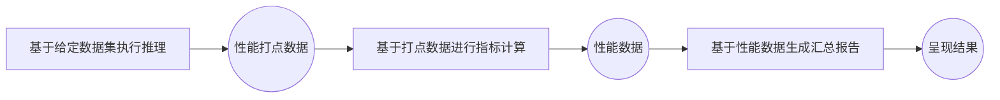

# 服务化性能测评指南
## 简介
AISBench Benchmark 提供服务化性能测评能力。针对流式推理场景，通过精确记录每条请求的发送时间、各阶段返回时间及响应内容，系统地评估模型服务在实际部署环境中的响应延迟（如 TTFT、Token间延迟）、吞吐能力（如 QPS、TPUT）、并发处理能力等关键性能指标。

用户可通过配置服务化后端参数，灵活控制请求内容、请求间隔、并发数量等，适配不同评测场景（如低并发延迟敏感型、高并发吞吐优先型等）。测评支持自动化执行并输出结构化结果，便于横向对比不同模型、部署方案、硬件配置下的服务性能差异。
## 服务化性能测评快速入门
### 命令含义
AISBench服务化性能测评命令含义与📚 [工具快速入门/命令含义](../../get_started/quick_start.md#命令含义)中的解释相同。在此基础上需要额外加上`--mode perf`或`-m perf`来进入性能评测场景，以如下AISBench命令为例：
```shell
ais_bench --models vllm_api_stream_chat --datasets demo_gsm8k_gen_4_shot_cot_chat_prompt --summarizer default_perf --mode perf
```
其中：
- `--models`指定了模型任务，即`vllm_api_stream_chat`模型任务。

- `--datasets`指定了数据集任务，即`demo_gsm8k_gen_4_shot_cot_chat_prompt`数据集任务。

- `--summarizer`指定了结果呈现任务，即`default_perf`结果呈现任务(不指定`--summarizer`精度评测场景默认使用`default_perf`任务)，一般使用默认，不需要在命令行中指定，后续命令不指定。

### 任务含义查询(可选)
所选模型任务`vllm_api_stream_chat`、数据集任务`demo_gsm8k_gen_4_shot_cot_chat_prompt`和结果呈现任务`default_perf`的具体信息(简介，使用约束等)可以分别从如下链接中查询含义：
- `--models`: 📚 [服务化推理后端](../all_params/models.md#服务化推理后端)

- `--datasets`:📚 [开源数据集](../all_params/datasets.md#开源数据集) → 📚 [详细介绍](https://github.com/AISBench/benchmark/tree/master/ais_bench/benchmark/configs/datasets/demo/README.md)

- `--summarizer`:📚 [结果汇总任务](../all_params/summarizer.md#支持的结果汇总任务)

### 运行命令前置准备
- `--models`: 使用`vllm_api_stream_chat`模型任务，需要准备支持`v1/chat/completions`子服务的推理服务，可以参考🔗 [VLLM启动OpenAI 兼容服务器](https://docs.vllm.com.cn/en/latest/getting_started/quickstart.html#openai-compatible-server)启动推理服务
- `--datasets`: 使用`demo_gsm8k_gen_4_shot_cot_chat_prompt`数据集任务，需要准备gsm8k数据集，可以从🔗 [opencompass
提供的gsm8k数据集压缩包](http://opencompass.oss-cn-shanghai.aliyuncs.com/datasets/data/gsm8k.zip)下载。将解压后的`gsm8k/`文件夹部署到AISBench评测工具根路径下的`ais_bench/datasets`文件夹下。

### 任务对应配置文件修改
每个模型任务、数据集任务和结果呈现任务都对应一个配置文件，运行命令前需要修改这些配置文件的内容。这些配置文件路径可以通过在原有AISBench命令基础上加上`--search`来查询，例如：
```shell
# 注意search的命令中是否加 "--mode perf" 不影响搜索结果
ais_bench --models vllm_api_stream_chat --datasets demo_gsm8k_gen_4_shot_cot_chat_prompt --mode perf --search
```
> ⚠️ **注意**： 执行带search命令会打印出任务对应的配置文件的绝对路径。

执行查询命令可以得到如下查询结果：
```shell
╒══════════════╤═══════════════════════════════════════╤════════════════════════════════════════════════════════════════════════════════════════════════════════════════════════════════╕
│ Task Type    │ Task Name                             │ Config File Path                                                                                                               │
╞══════════════╪═══════════════════════════════════════╪════════════════════════════════════════════════════════════════════════════════════════════════════════════════════════════════╡
│ --models     │ vllm_api_stream_chat                  │ /your_workspace/benchmark/ais_bench/benchmark/configs/models/vllm_api/vllm_api_stream_chat.py                                 │
├──────────────┼───────────────────────────────────────┼────────────────────────────────────────────────────────────────────────────────────────────────────────────────────────────────┤
│ --datasets   │ demo_gsm8k_gen_4_shot_cot_chat_prompt │ /your_workspace/benchmark/ais_bench/benchmark/configs/datasets/demo/demo_gsm8k_gen_4_shot_cot_chat_prompt.py                   │
╘══════════════╧═══════════════════════════════════════╧════════════════════════════════════════════════════════════════════════════════════════════════════════════════════════════════╛

```

- 快速入门中数据集任务配置文件`demo_gsm8k_gen_4_shot_cot_chat_prompt.py`不需要做额外修改，数据集任务配置文件内容介绍可参考📚 [配置开源数据集](../all_params/datasets.md#配置开源数据集)

模型配置文件`vllm_api_stream_chat.py`中包含了模型运行相关的配置内容，是需要依据实际情况修改的。快速入门中需要修改的内容用注释标明。
```python
from ais_bench.benchmark.models import VLLMCustomAPIChatStream

models = [
    dict(
        attr="service",
        type=VLLMCustomAPIChat,
        abbr='vllm-api-general-chat',
        path="",                    # 指定模型序列化词表文件绝对路径（精度测试场景一般不需要配置）
        model="",        # 指定服务端已加载模型名称，依据实际VLLM推理服务拉取的模型名称配置（配置成空字符串会自动获取）
        stream=True, # 服务化性能只支持评测流式接口
        request_rate=0,           # 请求发送频率，每1/request_rate秒发送1个请求给服务端，小于0.1则一次性发送所有请求
        retry=2,                  # 每个请求最大重试次数
        headers={"Content-Type": "application/json"}, # 自定义请求头，默认{"Content-Type": "application/json"}
        host_ip="localhost",      # 指定推理服务的IP
        host_port=8080,           # 指定推理服务的端口
        url="",                     # 自定义访问推理服务的URL路径(当base url不是http://host_ip:host_port的组合时需要配置，配置后host_ip和host_port将被忽略)
        max_out_len=512,          # 推理服务输出的token的最大数量
        batch_size=1,               # 请求发送的最大并发数
        trust_remote_code=False,    # tokenizer是否信任远程代码，默认False;
        generation_kwargs=dict(   # 模型推理参数，参考VLLM文档配置，AISBench评测工具不做处理，在发送的请求中附带
            temperature=0.01,
            ignore_eos=True, # 测性能时如果需要限定输出长度，需要将ignore_eos设置为True
        )
    )
]
```
### 执行命令
修改好配置文件后，执行命令启动服务化性能评测：
```bash
ais_bench --models vllm_api_stream_chat --datasets demo_gsm8k_gen_4_shot_cot_chat_prompt -m perf
```
#### 查看任务执行细节
执行AISBench命令后，正在执行的任务状态会在命令行实时刷新的看板上显示（键盘按"P"键可以停止刷新，用于复制看板信息，再按"P"可以继续刷新），例如：
```
Base path of result&log : outputs/default/20251106_103326
Task Progress Table (Updated at: 2025-11-06 10:34:41)
Page: 1/1  Total 2 rows of data
Press Up/Down arrow to page,  'P' to PAUZE/RESUME screen refresh, 'Ctrl + C' to exit

+---------------------------------+-----------+-------------------------------------------------+-------------+-------------+------------------------------------------------+------------------------------------------------+
| Task Name                       |   Process | Progress                                        | Time Cost   | Status      | Log Path                                       | Extend Parameters                              |
+=================================+===========+=================================================+=============+=============+================================================+================================================+
| vllm-api-stream-chat/demo_gsm8k |    744887 | [###########                   ] 3/8 [0.1 it/s] | 0:00:54     | inferencing | logs/infer/vllm-api-stream-chat/demo_gsm8k.out | {'POST': 4, 'RECV': 3, 'FINISH': 3, 'FAIL': 0} |
+---------------------------------+-----------+-------------------------------------------------+-------------+-------------+------------------------------------------------+------------------------------------------------+
`

```

任务执行的细节日志会不断落盘在默认的输出路径，这个输出路径在实时刷新的看板上显示，即`Log Path`。`Log Path`（`logs/infer/vllm-api-stream-chat/demo_gsm8k.out`）是在`Base path`（`outputs/default/20251106_103326`）下的路径，以上述的看板信息为例，任务执行的详细日志路径为：
```shell
# {Base path}/{Log Path}
outputs/default/20251106_103326/logs/infer/vllm-api-stream-chat/demo_gsm8k.out
```

> 💡 如果希望执行过程中将详细日志直接打印，执行命令时可以加上 `--debug`:
`ais_bench --models vllm_api_stream_chat --datasets demo_gsm8k_gen_4_shot_cot_chat_prompt -m perf --debug`

### 查看性能结果
性能结果打屏示例如下：

```bash
[2025-11-06 10:35:43,667] [ais_bench] [INFO] Performance Results of task: vllm-api-stream-chat/demo_gsm8k:
╒══════════════════════════╤═════════╤═════════════════╤═════════════════╤═════════════════╤═════════════════╤═════════════════╤═════════════════╤═════════════════╤═════╕
│ Performance Parameters   │ Stage   │ Average         │ Min             │ Max             │ Median          │ P75             │ P90             │ P99             │  N  │
╞══════════════════════════╪═════════╪═════════════════╪═════════════════╪═════════════════╪═════════════════╪═════════════════╪═════════════════╪═════════════════╪═════╡
│ E2EL                     │ total   │ 12300.2 ms      │ 12295.9 ms      │ 12305.2 ms      │ 12300.0 ms      │ 12302.1 ms      │ 12304.3 ms      │ 12305.1 ms      │  8  │
├──────────────────────────┼─────────┼─────────────────┼─────────────────┼─────────────────┼─────────────────┼─────────────────┼─────────────────┼─────────────────┼─────┤
│ TTFT                     │ total   │ 2006.0 ms       │ 2005.1 ms       │ 2007.4 ms       │ 2006.1 ms       │ 2006.2 ms       │ 2006.6 ms       │ 2007.3 ms       │  8  │
├──────────────────────────┼─────────┼─────────────────┼─────────────────┼─────────────────┼─────────────────┼─────────────────┼─────────────────┼─────────────────┼─────┤
│ TPOT                     │ total   │ 20.1 ms         │ 20.1 ms         │ 20.2 ms         │ 20.1 ms         │ 20.1 ms         │ 20.2 ms         │ 20.2 ms         │  8  │
├──────────────────────────┼─────────┼─────────────────┼─────────────────┼─────────────────┼─────────────────┼─────────────────┼─────────────────┼─────────────────┼─────┤
│ ITL                      │ total   │ 20.1 ms         │ 19.8 ms         │ 21.3 ms         │ 20.1 ms         │ 20.2 ms         │ 20.2 ms         │ 20.4 ms         │  8  │
├──────────────────────────┼─────────┼─────────────────┼─────────────────┼─────────────────┼─────────────────┼─────────────────┼─────────────────┼─────────────────┼─────┤
│ InputTokens              │ total   │ 1512.5          │ 1481.0          │ 1566.0          │ 1511.5          │ 1520.25         │ 1536.6          │ 1563.06         │  8  │
├──────────────────────────┼─────────┼─────────────────┼─────────────────┼─────────────────┼─────────────────┼─────────────────┼─────────────────┼─────────────────┼─────┤
│ OutputTokens             │ total   │ 512.0           │ 512.0           │ 512.0           │ 512.0           │ 512.0           │ 512.0           │ 512.0           │  8  │
├──────────────────────────┼─────────┼─────────────────┼─────────────────┼─────────────────┼─────────────────┼─────────────────┼─────────────────┼─────────────────┼─────┤
│ OutputTokenThroughput    │ total   │ 41.6254 token/s │ 41.6085 token/s │ 41.6398 token/s │ 41.6261 token/s │ 41.6338 token/s │ 41.6375 token/s │ 41.6395 token/s │  8  │
╘══════════════════════════╧═════════╧═════════════════╧═════════════════╧═════════════════╧═════════════════╧═════════════════╧═════════════════╧═════════════════╧═════╛
╒══════════════════════════╤═════════╤══════════════════╕
│ Common Metric            │ Stage   │ Value            │
╞══════════════════════════╪═════════╪══════════════════╡
│ Benchmark Duration       │ total   │ 98409.4916 ms    │
├──────────────────────────┼─────────┼──────────────────┤
│ Total Requests           │ total   │ 8                │
├──────────────────────────┼─────────┼──────────────────┤
│ Failed Requests          │ total   │ 0                │
├──────────────────────────┼─────────┼──────────────────┤
│ Success Requests         │ total   │ 8                │
├──────────────────────────┼─────────┼──────────────────┤
│ Concurrency              │ total   │ 0.9999           │
├──────────────────────────┼─────────┼──────────────────┤
│ Max Concurrency          │ total   │ 1                │
├──────────────────────────┼─────────┼──────────────────┤
│ Request Throughput       │ total   │ 0.0813 req/s     │
├──────────────────────────┼─────────┼──────────────────┤
│ Total Input Tokens       │ total   │ 12100            │
├──────────────────────────┼─────────┼──────────────────┤
│ Prefill Token Throughput │ total   │ 753.9843 token/s │
├──────────────────────────┼─────────┼──────────────────┤
│ Total Generated Tokens   │ total   │ 4096             │
├──────────────────────────┼─────────┼──────────────────┤
│ Input Token Throughput   │ total   │ 122.9556 token/s │
├──────────────────────────┼─────────┼──────────────────┤
│ Output Token Throughput  │ total   │ 41.622 token/s   │
├──────────────────────────┼─────────┼──────────────────┤
│ Total Token Throughput   │ total   │ 164.5776 token/s │
╘══════════════════════════╧═════════╧══════════════════╛
[2025-11-06 10:35:43,672] [ais_bench] [INFO] Performance Result files located in outputs/default/20251106_103326/performances/vllm-api-stream-chat.
```
💡 具体性能参数的含义请参考📚 [性能测评结果说明](../results_intro/performance_metric.md)

### 性能细节查看
执行AISBench命令后，任务执行更多细节最终会落盘在`Base path`（`outputs/default/20251106_103326`）

命令执行结束后`outputs/default/20250628_151326`中的任务执行的细节如下所示：
```shell
20251106_103326          # 每次实验基于时间戳生成的唯一目录
├── configs               # 自动存储的所有已转储配置文件
├── logs                  # 执行过程中日志，命令中如果加--debug，不会有过程日志落盘（都直接打印出来了）
│   └── performance/      # 推理阶段的日志文件
└── performance           # 性能测评结果
│    └── vllm-api-stream-chat/          # “服务化模型配置”名称，对应模型任务配置文件中models的 abbr参数
│         ├── demo_gsm8k.csv          # 单次请求性能输出（CSV），与性能结果打屏中的Performance Parameters表格一致
│         ├── demo_gsm8k.json         # 端到端性能输出（JSON），与性能结果打屏中的Common Metric表格一致
│         ├── demo_gsm8k_plot.html    # 请求并发可视化报告（HTML）
│         └── ......
```
💡其中 `demo_gsm8k_plot.html`这个请求并发可视化报告建议使用Chrome或者Edge等浏览器打开，可以看到每个请求的时延以及每个时刻client端感知的服务时间并发数：
  
该html可视化图文件的使用方式请参考📚 [性能测试可视化并发图使用说明](../results_intro/performance_visualization.md)

## 服务化性能测评前置约束
在执行服务化推理前，需要满足以下条件：

- 可访问的服务化模型服务：确保服务进程可在当前环境下直接访问。
- 数据集准备：
    - 开源数据集：从📚 [开源数据集](../all_params/datasets.md#开源数据集)中选择数据集，并且在数据集对应的"详细介绍"文档中选择要执行的数据集任务。参考选取的数据集任务对应的"详细介绍"文档准备好数据集文件，建议将开源数据集手动放置在默认目录 `ais_bench/datasets/`下，程序将在任务执行时自动加载数据集文件。
    - 随机合成数据集：数据集任务选`synthetic_gen`，其他配置参考📚 [随机合成数据集](../../advanced_tutorials/synthetic_dataset.md)。
    - 自定义数据集：无需指定数据集任务，其他配置参考📚 [自定义数据集](../../advanced_tutorials/custom_dataset.md)。
- 服务化模型后端配置：从[服务化推理后端](../all_params/models.md#服务化推理后端)中选择接口类型为`流式接口`的子服务（⚠️  其他不支持）。

## 主要功能场景
### 单任务评测
参考[服务化性能测评快速入门](#服务化性能测评快速入门)
### 多任务测评
支持同时配置多个模型或多个数据集任务，通过单次命令进行批量测评，适用于多个测试命令串行执行。
#### 命令说明
用户可通过`--models`和`--datasets`参数指定多个配置任务，子任务数为`--models`配置任务数和`--datasets`配置任务数的乘积，即一个模型配置和一个数据集配置组成一个子任务，示例：
```bash
ais_bench --models vllm_api_general_stream vllm_api_stream_chat --datasets gsm8k_gen_4_shot_cot_str aime2024_gen_0_shot_str --mode perf
```
上述命令指定了2个模型任务（`vllm_api_general_stream` `vllm_api_stream_chat`）和2个数据集任务（`gsm8k_gen_4_shot_cot_str` `aime2024_gen_0_shot_str`），将执行以下4个组合性能测试任务：
+ [vllm_api_general_stream](https://github.com/AISBench/benchmark/tree/master/ais_bench/benchmark/configs/models/vllm_api/vllm_api_general_stream.py)模型任务 + [gsm8k_gen_4_shot_cot_str](https://github.com/AISBench/benchmark/tree/master/ais_bench/benchmark/configs/datasets/gsm8k/gsm8k_gen_4_shot_cot_str.py) 数据集任务
+ [vllm_api_general_stream](https://github.com/AISBench/benchmark/tree/master/ais_bench/benchmark/configs/models/vllm_api/vllm_api_general_stream.py)模型任务 + [aime2024_gen_0_shot_str](https://github.com/AISBench/benchmark/tree/master/ais_bench/benchmark/configs/datasets/aime2024/aime2024_gen_0_shot_str) 数据集任务
+ [vllm_api_stream_chat](https://github.com/AISBench/benchmark/tree/master/ais_bench/benchmark/configs/models/vllm_api/vllm_api_stream_chat.py)模型任务 + [gsm8k_gen_4_shot_cot_str](https://github.com/AISBench/benchmark/tree/master/ais_bench/benchmark/configs/datasets/gsm8k/gsm8k_gen_4_shot_cot_str.py) 数据集任务
+ [vllm_api_stream_chat](https://github.com/AISBench/benchmark/tree/master/ais_bench/benchmark/configs/models/vllm_api/vllm_api_stream_chat.py)模型任务 + [aime2024_gen_0_shot_str](https://github.com/AISBench/benchmark/tree/master/ais_bench/benchmark/configs/datasets/aime2024/aime2024_gen_0_shot_str.py) 数据集任务

#### 修改任务对应的配置文件
模型任务和数据集任务对应的配置文件实际路径通过执行加`--search`命令查询：
```bash
ais_bench --models vllm_api_general_stream vllm_api_stream_chat --datasets gsm8k_gen_4_shot_cot_str aime2024_gen_0_shot_str --mode perf --search
```
查询到如下配置文件需要修改：
```bash
╒═════════════╤══════════════════════════╤═══════════════════════════════════════════════════════════════════════════════════════════════════════════════════════════╕
│ Task Type   │ Task Name                │ Config File Path                                                                                                          │
╞═════════════╪══════════════════════════╪═══════════════════════════════════════════════════════════════════════════════════════════════════════════════════════════╡
│ --models    │ vllm_api_general_stream  │ /your_workspace/benchmark_test/ais_bench/benchmark/configs/models/vllm_api/vllm_api_general_stream.py                     │
├─────────────┼──────────────────────────┼───────────────────────────────────────────────────────────────────────────────────────────────────────────────────────────┤
│ --models    │ vllm_api_stream_chat     │ /your_workspace/benchmark_test/ais_bench/benchmark/configs/models/vllm_api/vllm_api_stream_chat.py                        │
├─────────────┼──────────────────────────┼───────────────────────────────────────────────────────────────────────────────────────────────────────────────────────────┤
│ --datasets  │ gsm8k_gen_4_shot_cot_str │ /your_workspace/benchmark_test/ais_bench/benchmark/configs/datasets/gsm8k/gsm8k_gen_4_shot_cot_str.py                     │
├─────────────┼──────────────────────────┼───────────────────────────────────────────────────────────────────────────────────────────────────────────────────────────┤
│ --datasets  │ aime2024_gen_0_shot_str  │ /your_workspace/benchmark_test/ais_bench/benchmark/configs/datasets/aime2024/aime2024_gen_0_shot_str.py                   │
╘═════════════╧══════════════════════════╧═══════════════════════════════════════════════════════════════════════════════════════════════════════════════════════════╛

```
- 参考📚 [服务化推理后端配置参数说明](../all_params/models.md#服务化推理后端配置参数说明)按照实际情况配置模型任务`vllm_api_general_streamt`和`vllm_api_stream_chat`对应的配置文件。
- 参考📚 [配置开源数据集](../all_params/datasets.md#配置开源数据集)按照实际情况配置数据集任务`gsm8k_gen_4_shot_cot_str`和`aime2024_gen_0_shot_str`对应的配置文件。**注**：如果数据集放在默认目录 `ais_bench/datasets/`下，则一般不需要配置

#### 执行评测命令
执行命令：
```bash
ais_bench --models vllm_api_general_stream vllm_api_stream_chat --datasets gsm8k_gen_4_shot_cot_str aime2024_gen_0_shot_str --mode perf
```

执行过程中会在📚 [`--work-dir`](../all_params/cli_args.md#公共参数)路径（默认是`outputs/default/`）下创建时间戳目录用于保存执行细节。
4个性能评测任务结束后会一次性打印4个任务的性能结果：
```bash
[2025-11-06 10:35:43,667] [ais_bench] [INFO] Performance Results of task: vllm-api-stream-chat/demo_gsm8k:
╒══════════════════════════╤═════════╤═════════════════╤═══════════════╤═════════════════╤═════════════════╤═════════════════╤═════════════════╤═════════════════╤══════╕
│ Performance Parameters   │ Stage   │ Average         │ Min           │ Max             │ Median          │ P75             │ P90             │ P99             │  N   │
╞══════════════════════════╪═════════╪═════════════════╪═══════════════╪═════════════════╪═════════════════╪═════════════════╪═════════════════╪═════════════════╪══════╡
│ E2EL                     │ total   │ 2754.0929 ms    │ 2189.0804 ms  │ 3366.1463 ms    │ 2753.1668 ms    │ 3048.2929 ms    │ 3222.573 ms     │ 3303.3894 ms    │ 1319 │
......
╒══════════════════════════╤═════════╤════════════════════╕
│ Common Metric            │ Stage   │ Value              │
╞══════════════════════════╪═════════╪════════════════════╡
│ Benchmark Duration       │ total   │ 38039.9928 ms      │
......
[2025-11-06 11:11:33,468] [ais_bench] [INFO] Performance Result files located in outputs/default/20251106_110904/performances/vllm-api-general-stream.
[2025-11-06 11:11:33,468] [ais_bench] [INFO] Performance Results of task: vllm-api-general-stream/aime2024:
╒══════════════════════════╤═════════╤═════════════════╤════════════════╤════════════════╤═══════════════╤═════════════════╤═════════════════╤═════════════════╤═════╕
│ Performance Parameters   │ Stage   │ Average         │ Min            │ Max            │ Median        │ P75             │ P90             │ P99             │  N  │
╞══════════════════════════╪═════════╪═════════════════╪════════════════╪════════════════╪═══════════════╪═════════════════╪═════════════════╪═════════════════╪═════╡
│ E2EL                     │ total   │ 2868.1822 ms    │ 2277.1049 ms   │ 3307.2084 ms   │ 2941.6767 ms  │ 3158.5361 ms    │ 3220.2141 ms    │ 3307.0174 ms    │ 30  │
......
╒══════════════════════════╤═════════╤═══════════════════╕
│ Common Metric            │ Stage   │ Value             │
╞══════════════════════════╪═════════╪═══════════════════╡
│ Benchmark Duration       │ total   │ 3346.9782 ms      │
......
[2025-11-06 11:11:33,471] [ais_bench] [INFO] Performance Result files located in outputs/default/20251106_110904/performances/vllm-api-general-stream.
[2025-11-06 11:11:33,471] [ais_bench] [INFO] Performance Results of task: vllm-api-stream-chat/gsm8k:
╒══════════════════════════╤═════════╤═════════════════╤════════════════╤═════════════════╤═════════════════╤═════════════════╤════════════════╤═════════════════╤══════╕
│ Performance Parameters   │ Stage   │ Average         │ Min            │ Max             │ Median          │ P75             │ P90            │ P99             │  N   │
╞══════════════════════════╪═════════╪═════════════════╪════════════════╪═════════════════╪═════════════════╪═════════════════╪════════════════╪═════════════════╪══════╡
│ E2EL                     │ total   │ 2753.3518 ms    │ 2189.5185 ms   │ 3339.4463 ms    │ 2755.8153 ms    │ 3039.7431 ms    │ 3219.6642 ms   │ 3313.0408 ms    │ 1319 │
......
╒══════════════════════════╤═════════╤════════════════════╕
│ Common Metric            │ Stage   │ Value              │
╞══════════════════════════╪═════════╪════════════════════╡
│ Benchmark Duration       │ total   │ 38101.2396 ms      │
......
[2025-11-06 11:11:33,474] [ais_bench] [INFO] Performance Result files located in outputs/default/20251106_110904/performances/vllm-api-stream-chat.
[2025-11-06 11:11:33,474] [ais_bench] [INFO] Performance Results of task: vllm-api-stream-chat/aime2024:
╒══════════════════════════╤═════════╤═════════════════╤═══════════════╤════════════════╤═════════════════╤═════════════════╤═════════════════╤═════════════════╤═════╕
│ Performance Parameters   │ Stage   │ Average         │ Min           │ Max            │ Median          │ P75             │ P90             │ P99             │  N  │
╞══════════════════════════╪═════════╪═════════════════╪═══════════════╪════════════════╪═════════════════╪═════════════════╪═════════════════╪═════════════════╪═════╡
│ E2EL                     │ total   │ 2745.4115 ms    │ 2187.5882 ms  │ 3288.4635 ms   │ 2820.7541 ms    │ 2988.8338 ms    │ 3188.436 ms     │ 3273.7475 ms    │ 30  │
......
╒══════════════════════════╤═════════╤═══════════════════╕
│ Common Metric            │ Stage   │ Value             │
╞══════════════════════════╪═════════╪═══════════════════╡
│ Benchmark Duration       │ total   │ 3335.7672 ms      │
......
[2025-11-06 11:11:33,477] [ais_bench] [INFO] Performance Result files located in outputs/default/20251106_110904/performances/vllm-api-stream-chat.

```

同时最终生成的目录结构如下：


```bash
# output/default下
20251106_110904/     # 任务创建时间对应的输出目录
├── configs          # 模型任务、数据集任务和结构呈现任务对应的配置文件合成的一个配置件
├── logs             # 包含推理与精度评估阶段的日志，命令加--debug时会直接打屏不会生成落盘文件
│   └── performance  # 推理阶段的日志文件
└── performances     # 性能测评结果
    ├── vllm-api-general-stream            # “服务化模型配置”名称，对应模型任务配置文件中models的 abbr参数
    │   ├── aime2024.csv            # 单次请求性能输出（CSV），与性能结果打屏中的Performance Parameters表格一致
    │   ├── aime2024.json           # 端到端性能输出（JSON），与性能结果打屏中的Common Metric表格一致
    │   ├── aime2024_plot.html      # 请求并发可视化报告（HTML）
    │   ├── gsm8k.csv
    │   ├── gsm8k.json
    │   ├── gsm8k_plot.html
    │   └── ......
    └── vllm-api-stream-chat
        ├── aime2024.csv
        ├── aime2024.json
        ├── aime2024_plot.html
        ├── gsm8k.csv
        ├── gsm8k.json
        ├── gsm8k_plot.html
        └── ......

```
> ⚠️ 注意：
> - 在多任务性能测评场景下，`--datasets`指定的数据集任务必须属于不同的数据集类型，性能数据会因为覆盖而缺失。例如不可通过`--datasets`同时指定`aime2024_gen_0_shot_str` 和 `aime2024_gen_0_shot_chat_prompt`这两个数据集任务。


### 自定义序列长度测评
#### 1 配置自定义序列数据集输入输出分布
自定义序列长度测评需要指定特殊的数据集任务`synthetic_gen_string`，执行如下命令来检索`synthetic_gen_string`对应的配置文件所在路径”：
```bash
ais_bench --models vllm_api_stream_chat --datasets synthetic_gen_string --search
```
得到：
```
╒══════════════╤═══════════════════════════════════════╤════════════════════════════════════════════════════════════════════════════════════════════════════════════════════════════════╕
│ Task Type    │ Task Name                             │ Config File Path                                                                                                               │
╞══════════════╪═══════════════════════════════════════╪════════════════════════════════════════════════════════════════════════════════════════════════════════════════════════════════╡
│ --models     │ vllm_api_stream_chat                  │ /your_workspace/benchmark/ais_bench/benchmark/configs/models/vllm_api/vllm_api_stream_chat.py                                 │
├──────────────┼───────────────────────────────────────┼────────────────────────────────────────────────────────────────────────────────────────────────────────────────────────────────┤
│ --datasets   │ synthetic_gen_string                  │ /your_workspace/benchmark/ais_bench/benchmark/configs/datasets/synthetic/synthetic_gen_string.py                               │
╘══════════════╧═══════════════════════════════════════╧════════════════════════════════════════════════════════════════════════════════════════════════════════════════════════════════╛
```

修改`/your_workspace/benchmark/ais_bench/benchmark/configs/datasets/synthetic/synthetic_gen_string.py`中的`synthetic_config`。配置内容如下所示：
```python
synthetic_config = {
    "Type": "string",
    "RequestCount": 1000, # 请求个数（数据集条数）
    "StringConfig": {
        "Input": {
            "Method": "uniform",
            "Params": {"MinValue": 50, "MaxValue": 500}  # 输入长度50-500
        },
        "Output": {
            "Method": "uniform",
            "Params": {"MinValue": 20, "MaxValue": 200}  # 输出长度20-200
        }
    }
}
```
💡更多的自定义输入输出分布可参考📚 [随机合成数据集](../../advanced_tutorials/synthetic_dataset.md)

#### 2 确保推理服务达到设置的最大输出
为了确保推理服务达到设置的最大输出，需要在📚 [服务化模型配置](../all_params/models.md#服务化推理后端配置参数说明)的 `generation_kwargs` 中配置特殊的后处理参数`ignore_eos = True`，以控制请求的最大输出长度（不提前结束）。

例如修改`vllm_api_stream_chat`模型任务对应的配置文件[vllm_api_stream_chat.py](https://github.com/AISBench/benchmark/tree/master/ais_bench/benchmark/models/vllm_api/vllm_api_stream_chat.py)内容：
```python
from ais_bench.benchmark.models import VLLMCustomAPIChatStream
models = [
    dict(
        attr="service",
        type=VLLMCustomAPIChatStream,
        abbr='vllm-api-stream-chat',
        # 端口 IP等其他模型任务参数请自行配置好
        generation_kwargs = dict(
            # .....
            ignore_eos = True,      # 推理服务输出忽略eos（输出长度一定会达到max_out_len）
        )
    )
]

```

#### 3 启动性能测评
执行以下命令：
```bash
ais_bench --models  vllm_api_stream_chat --datasets synthetic_gen_string -m perf
```
完成后，输出目录结构同[多任务测评](#多任务测评)章节所示，会在 performance/vllm-api-stream-chat/synthetic* 下生成相应的 CSV/JSON/HTML 文件。
> ⚠️ 注意：
> - 部分服务化后端不支持 `ignore_eos` 后处理参数，此时实际输出的 `Token` 数可能无法达到所配置的最大输出长度，需要通过其他后处理参数的配置达到最大输出长度（例如限定最小输出的后处理参数等）。

### 固定请求数测评

当集规模过大，只想针数据对部分样本执行性能测试时，可使用 📚 [`--num-prompts`](../all_params/cli_args.md#性能测评参数) 参数指定读取的数据条数。示例如下：
```bash
ais_bench --models vllm_api_stream_chat --datasets demo_gsm8k_gen_4_shot_cot_chat_prompt -m perf --num-prompts 1
```
上述命令仅对示例数据集中的第一条记录进行推理并测量性能。
> ⚠️ 注意：当前数据集会按照默认队列顺序依次读取，不支持随机抽样或打乱顺序。


## 其他功能场景
### 性能结果重计算
性能测试的主要功能场景评测工具会执行完整的性能采样 → 计算 → 汇总流程

执行流程的每个环节是独立解耦的，计算和汇总可以基于性能采样的结果反复执行。如果直接打印出的性能数据不包含相关维度的数据（例如缺少percentage 95%的数据），就需要做一些配置修改来重计算，具体操作如下。

假设上次执行性能测评的命令是：
```bash
ais_bench --models vllm_api_stream_chat --datasets demo_gsm8k_gen_4_shot_cot_chat_prompt --mode perf
```
打印出的`Performance Parameters`表格如下所示：
```bash
[2025-11-06 11:11:33,463] [ais_bench] [INFO] Performance Results of task: vllm-api-general-stream/gsm8k:
╒══════════════════════════╤═════════╤═════════════════╤════════════════╤═════════════════╤═════════════════╤═════════════════╤════════════════╤═════════════════╤══════╕
│ Performance Parameters   │ Stage   │ Average         │ Min            │ Max             │ Median          │ P75             │ P90            │ P99             │  N   │
╞══════════════════════════╪═════════╪═════════════════╪════════════════╪═════════════════╪═════════════════╪═════════════════╪════════════════╪═════════════════╪══════╡
│ E2EL                     │ total   │ 2753.3518 ms    │ 2189.5185 ms   │ 3339.4463 ms    │ 2755.8153 ms    │ 3039.7431 ms    │ 3219.6642 ms   │ 3313.0408 ms    │ 1319 │
......
```

如果想知道“P95”维度的性能数据，需要修改`--summarizer`对应的默认结果呈现任务default_perf对应的配置文件内容，default_perf的路径通过`--search`命令查询：
```bash
╒══════════════╤══════════════╤═══════════════════════════════════════════════════════════════════════════════════════════════════════════════╕
│ Task Type    │ Task Name    │ Config File Path                                                                                              │
╞══════════════╪══════════════╪═══════════════════════════════════════════════════════════════════════════════════════════════════════════════╡
│ --summarizer │ default_perf │ /your_workspace/ais_bench/benchmark/configs/summarizers/perf/default_perf.py                                  │
╘══════════════╧══════════════╧═══════════════════════════════════════════════════════════════════════════════════════════════════════════════╛

```

修改default_perf.py的内容：
```py
from mmengine.config import read_base
from ais_bench.benchmark.summarizers import DefaultPerfSummarizer
from ais_bench.benchmark.calculators import DefaultPerfMetricCalculator

summarizer = dict(
    type=DefaultPerfSummarizer,
    calculator=dict(
        type=DefaultPerfMetricCalculator,
        stats_list=["Average", "Min", "Max", "Median", "P95"],
    )
)
```
其中`stats_list`中最多同时承载8个性能维度的数据。

修改完毕后可以执行如下命令重计算性能指标：

```bash
## 注意必须指定--summarizer default_perf
ais_bench --models vllm_api_stream_chat --datasets demo_gsm8k_gen_4_shot_cot_chat_prompt --summarizer default_perf --mode perf_viz --pressure --debug --reuse 20250628_151326
```
性能结果打屏如下：
```bash
[2025-11-06 11:11:33,463] [ais_bench] [INFO] Performance Results of task: vllm-api-general-stream/gsm8k:
╒══════════════════════════╤═════════╤════════════════╤═════════════════╤═════════════════╤════════════════╤═════════════════╤═════╕
│ Performance Parameters   │ Stage   │ Average        │ Min             │ Max             │ Median         │ P95             │  N  │
╞══════════════════════════╪═════════╪════════════════╪═════════════════╪═════════════════╪════════════════╪═════════════════╪═════╡
│ E2EL                     │ total   │ 2761.6153 ms   │ 2493.8016 ms    │ 3086.0523 ms    │ 2848.9603 ms   │ 3021.0043 ms    │  8  │
......
╒══════════════════════════╤═════════╤═══════════════════╕
│ Common Metric            │ Stage   │ Value             │
╞══════════════════════════╪═════════╪═══════════════════╡
│ Benchmark Duration       │ total   │ 3090.7835 ms      │
......
[2025-11-06 11:11:33,468] [ais_bench] [INFO] Performance Result files located in outputs/default/20251106_110904/performances/vllm-api-general-stream.

```
> ⚠️  `20251106_110904/performance/`下`gsm8kdataset.csv`，`gsm8kdataset_details.json`和`gsm8kdataset_plot.html`会重新生成（覆盖原有的）。

## 服务化性能测试规格说明
服务化性能测试的规模决定了AISBench评测工具的资源占用。以[自定义序列长度测评](#自定义序列长度测评)为例，测试规模主要由总请求条数（`RequestCount`）、数据集输入tokens长度（`Input`）,输出tokens长度（`Output`）决定。在`Intel(R) Xeon(R) Platinum 8480P`型号cpu上测试，典型测试规模下资源的占用大致如下：
|总请求条数（`RequestCount`）|数据集输入tokens长度（`Input`）|tokens长度（`Output`）|最大内存占用(GB)|最大磁盘占用(GB)|性能数据计算时间(s)|备注|
| ---------- | --------- | ----------- | ---------- | ----------- | ------------| ---|
|10000|1024|1024|< 16|0.12|3||
|10000|1024|4096|< 16|0.16|4||
|10000|4096|4096|< 16|0.17|6||
|50000|4096|4096|< 32|0.80|30||
|250000|4096|4096|< 64|4.00|150|最大规格|

> ⚠️ 性能数据的最大内存占用、最大磁盘占用和计算时长大致与（`RequestCount × (Input + Output)`）大小成正比，AISBench单机能支持的最大规格为`RequestCount × (Input + Output) = 250000 * (4096 + 4096) = 2,024,000,000`